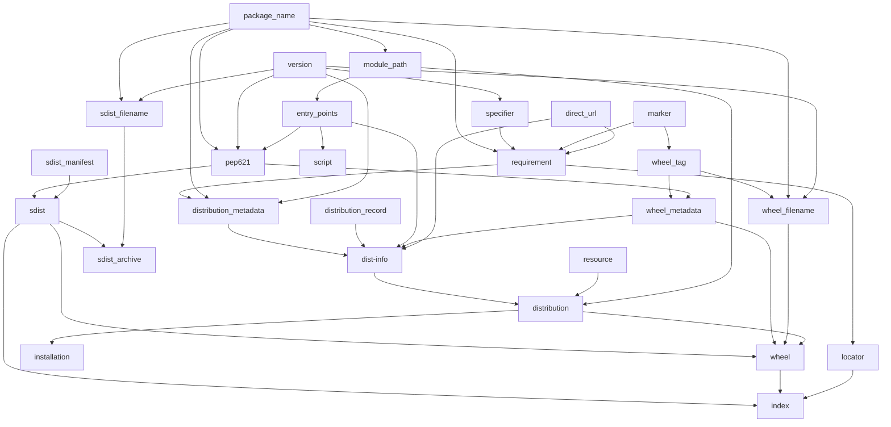

Python packaging ecosystem entities review
==========================================

([`chart.dot`](./chart.dot) is the version for GraphViz. Unfortunately GitHub doesn't support it yet.)

For see [the glossary](./glossary.tsv) for
* the descriptions of the entities and their capabilities;
* references to PEPs where they are defined (`https://peps.python.org/pep-<pep_number>/`);
* references to PyPA documents where they are defined (`https://packaging.python.org/en/latest/specifications/<spec_name>/`).

[`compact_matrix.tsv`](./compact_matrix.tsv) shows how well different libs support various entities involved into Python packaging:
* ✅ - mostly implemented
* ⚠ - somehow implemented
* ❌ - mostly unimplemented
* ? - yet to be determined

[`full_matrix.tsv`](./full_matrix.tsv) shows the support of subfeatures in tools:
* ✅ - implemented
* ⚠ - implemented, but so poorly, that one is better to use something else
* ❌ - unimplemented
* ? - yet to be determined
